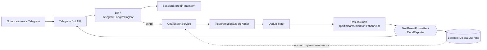

# Telegram Export Participants Bot — документация

## Назначение
Бот принимает JSON-экспорт чатов из Telegram Desktop, выделяет уникальных участников, упоминания и каналы, а затем отправляет результат в текстовом виде или в Excel (в зависимости от количества найденных участников). Данные не сохраняются: файлы обрабатываются во временной директории и удаляются после завершения сессии.

## Архитектура
- **Входной слой (Telegram Long Polling).** `BotApplication` поднимает Spring Boot и регистрирует `Bot` в Telegram API (long polling). Все апдейты идут через класс `Bot`.
- **Управление сессиями.** `SessionStore` хранит состояния чатов в памяти (`Session`), применяются лимиты: до 10 файлов за раз, TTL сессии — 30 минут, состояние пользователя (`UserState`) переключается между ожиданием файлов, готовностью к обработке и обработкой.
- **Обработка файлов.** После нажатия «Начать обработку» каждый файл скачивается отдельным запросом Telegram API в уникальный temp-каталог. Для каждого файла запускается обработка в пуле потоков, чтобы не блокировать polling.
- **Парсинг и дедупликация.** `ChatExportService` агрегирует результаты нескольких файлов. `TelegramJsonExportParser` обходит `messages` в JSON: извлекает авторов, упоминания (@username) и ссылки вида t.me/*; `Deduplicator` убирает дубли и фильтрует удалённые аккаунты.
- **Формирование ответа.** Если участников ≤ 50 — `TextResultFormatter` строит текстовый отчет. Если > 50 — `ExcelExporter` формирует XLSX с тремя вкладками: «Участники», «Упоминания», «Каналы».
- **UI слоя бота.** `UiTexts` содержит текстовые шаблоны, `Keyboards` — inline-клавиатуры (start/ready/restart). Кнопки и команды `/start`, `/stop` управляют текущей сессией.
- **Очистка.** После отправки результата сессия сбрасывается, временные файлы и каталоги удаляются рекурсивно.

## Схема компонентов

## Технологический стек
- Java 17, Spring Boot 3.1 (DI, конфигурация, запуск).
- Telegram Bots Java API 6.7 (long polling).
- Jackson Databind (чтение JSON-экспорта Telegram Desktop).
- Apache POI 5.5 (XLSX-экспорт).
- Lombok (минимизация шаблонного кода).
- JUnit 5 (юнит-тесты парсинга, дедупликации, экспорта).
- Maven (сборка), Docker/Docker Compose (контейнеризация, запуск).

## Инструкция пользователя
1. **Подготовка токена.** Создайте бота через @BotFather и возьмите `BOT_TOKEN`; задайте имя вида `@your_bot`. Храните секреты вне репозитория.
2. **Конфигурация.** Задайте переменные среды (Spring автоматически подхватит их):  
   - `TELEGRAM_BOT_TOKEN` — токен бота.  
   - `TELEGRAM_BOT_NAME` — юзернейм бота с `@`.  
   При желании можно заменить значения в `src/main/resources/application.properties`, но безопаснее использовать переменные среды или `.env` рядом с `docker-compose.yml`.
3. **Локальный запуск.** Требуется JDK 17 и Maven. Запустите `mvn spring-boot:run` в корне проекта. Порт по умолчанию — `8080`.
4. **Запуск в Docker.** Создайте `.env` с переменными `TELEGRAM_BOT_TOKEN` и `TELEGRAM_BOT_NAME`. Выполните `docker compose up --build`; контейнер слушает порт `8080`.
5. **Работа с ботом (для конечного пользователя).**
   - Отправьте команду `/start` в чат с ботом.
   - В Telegram Desktop экспортируйте историю чата в формате **JSON** (`Export chat history` → JSON).
   - Пришлите боту от 1 до 10 JSON-файлов. Бот покажет, сколько файлов загружено.
   - Нажмите «Начать обработку». Пока идет обработка, новые файлы не принимаются.
   - Если найдено ≤ 50 участников — бот отправит текстовый список. Если > 50 — вернёт Excel c вкладками `participants / mentions / channels`.
   - Команда `/stop` или кнопка «Начать заново» сбрасывает текущую сессию.
6. **Завершение.** После получения ответа можно начать новый экспорт или нажать «Обработать другой чат».

### Кнопки и меню
- **Как экспортировать чат** — краткая инструкция по шагам в Telegram Desktop.
- **FAQ** — подсказки по использованию бота, напоминание про лимиты и формат JSON.
- **Начать обработку** — запускает обработку всех уже загруженных файлов; новые файлы в этот момент не принимаются.
- **Обработать другой чат** — сбрасывает текущую сессию и возвращает в стартовое меню.
- **Начать заново** — появляется при истечении сессии; создаёт новую сессию.

## Технические ограничения
- **Формат файлов:** только экспорт Telegram Desktop в формате JSON. Другие форматы отклоняются.
- **Количество файлов:** до 10 файлов в одной сессии (`MAX_FILES`), загружаются по одному; если лимит достигнут — предложит начать новую сессию.
- **Порог для Excel:** при количестве участников > 50 ответ уходит в XLSX, иначе — текст в чат.
- **Срок жизни сессии:** 30 минут бездействия (`SESSION_TTL_MINUTES`); по истечении требуется начать заново.
- **Размер файла:** явного ограничения в коде нет, но действует лимит Telegram Bot API на загрузку документов; большие файлы могут быть отвергнуты API.
- **Файловая безопасность:** имена входных файлов нормализуются (`safeFilename`) для кросс-платформенности; временные файлы создаются в системном `/tmp` и удаляются после завершения обработки.
- **Конфиденциальность:** данные не сохраняются ни в базе, ни в постоянном хранилище; обработка и сессии находятся только в оперативной памяти и временных файлах, которые удаляются по завершении.

