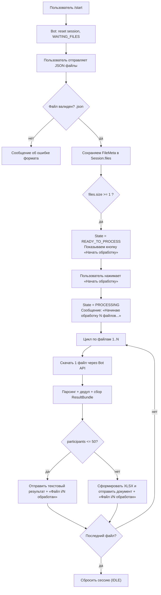
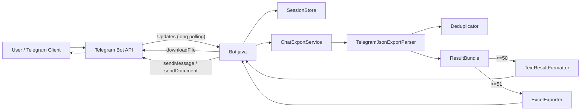
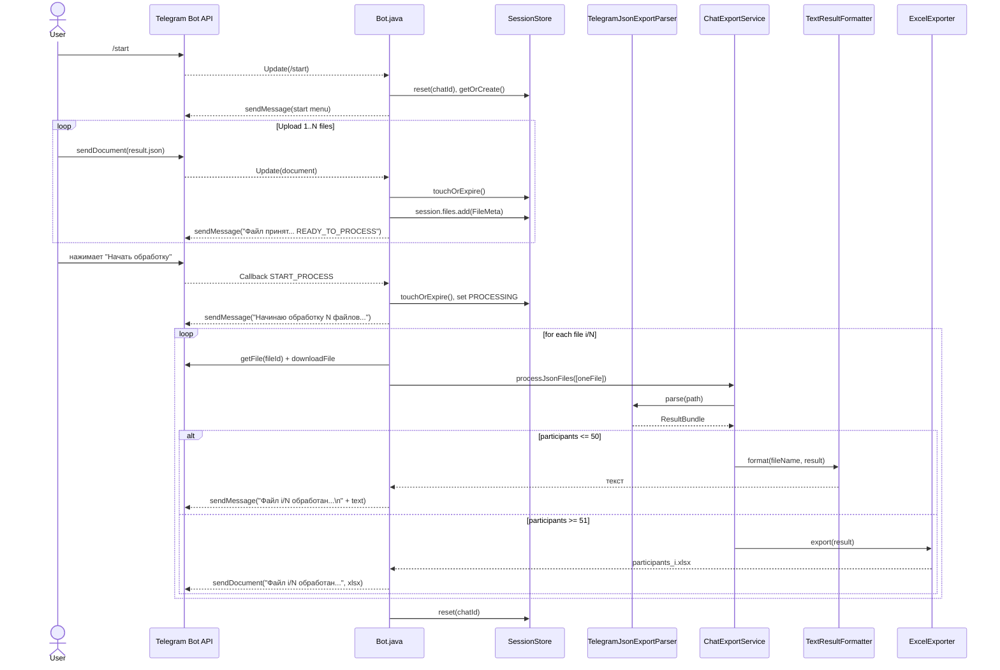
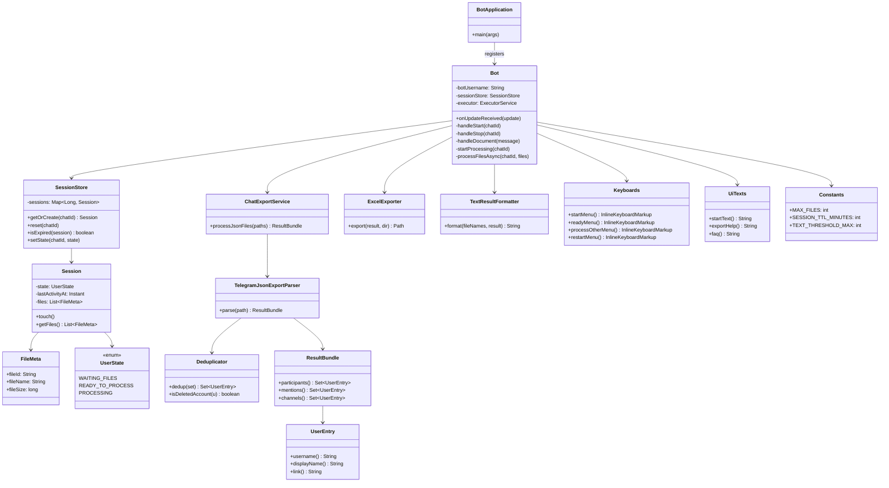
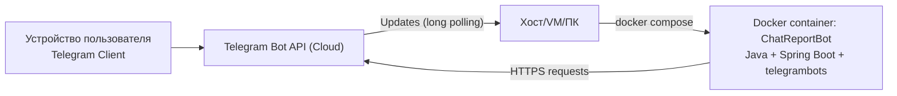

# Архитектура проекта

## 1. Архитектурное решение

### 1.1 Разделение на слои
Архитектура построена как лёгкая многослойная схема:

1) **Telegram-интеграция / orchestration (Bot.java)**  
   Отвечает за:
   - обработку апдейтов (команды, документы, callback-кнопки),
   - скачивание файлов через Bot API,
   - управление жизненным циклом сессии,
   - запуск обработки (в отдельном потоке),
   - отправку результата пользователю.

2) **Сессии и состояние (session/**)  
   Нужны из-за сценария “копим файлы → жмём кнопку”.  
   Сессии хранятся **только в памяти**, без БД, потому что:
   - ТЗ не требует устойчивого хранения,
   - важнее приватность и простота,
   - бот учебный/хакатонный (минимум инфраструктуры).

3) **Core-логика (core/**)  
   - `TelegramJsonExportParser` — парсит экспорт Telegram Desktop (JSON) максимально устойчиво (через `JsonNode`, так как структура экспорта может отличаться между версиями клиента).
   - `Deduplicator` — удаление дублей и фильтрация удалённых аккаунтов.
   - `ChatExportService` — оркестратор обработки файлов (агрегация результатов).

4) **Вывод результата (export/**)  
   - `TextResultFormatter` — формирует текст строго по требованиям (раздельно “Участники” и “Упоминания”, чтобы не было перемешивания).
   - `ExcelExporter` — создаёт `.xlsx` (3 вкладки) с требуемыми колонками и “заморозкой” шапки.

5) **UI-слой (ui/**)  
   Изолирует тексты и клавиатуры, чтобы не раздувать `Bot.java` и упростить поддержку UX.

Такое разделение напрямую покрывает требование ТЗ о “чётком процессе, стабильности, отсутствии хранения данных и разных форматах результата”.

### 1.2 Почему Spring Boot (а не “plain Java”)
В проекте используется **Spring Boot** не ради REST/портов, а как **инфраструктурный контейнер**:
- Dependency Injection (удобно собирать бота, стор сессий, конфиг);
- конфиг через `application.properties` и env-переменные;
- логирование “из коробки” (через SLF4J/Logback);
- простая сборка в fat-jar для Docker.

При этом сам бот работает в режиме **long polling**, т.е. входящий HTTP-порт не обязателен.

### 1.3 Почему именно эти библиотеки
- **telegrambots** — стандартная библиотека для LongPollingBot, позволяет скачивать файлы и отправлять документы/сообщения.
- **Jackson** — быстрый и гибкий JSON-парсер; `JsonNode` даёт устойчивость к вариациям структуры экспорта.
- **Apache POI** — де-факто стандарт для XLSX в Java.
- **JUnit 5** — модульные тесты (парсер/дедуп/экспорт).
- **Lombok** — сокращение шаблонного кода (логгер, конструкторы).

---

## 2. Структура проекта (по пакетам)

- `com.example.BotApplication`  
  Точка входа: запускает Spring Boot и регистрирует Telegram-бота в `TelegramBotsApi`.

- `com.example.Bot`  
  Главный обработчик Telegram-апдейтов и orchestrator сценариев.

- `com.example.session/`  
  Сессии пользователя (на chatId), TTL, список загруженных файлов, состояние.

- `com.example.core/`  
  Основная обработка: парсинг экспорта, дедупликация, агрегация результата.

- `com.example.export/`  
  Генерация результата (текст/Excel).

- `com.example.ui/`  
  Кнопки (InlineKeyboard) и тексты меню/подсказок.

- `com.example.enums/`  
  Константы (лимиты, callback-данные), состояния.

---

## 3. Состояния сессии и как реализовано в коде

Оперирует состояниями: `IDLE`, `WAITING_FILES`, `READY_TO_PROCESS`, `PROCESSING`, `EXPIRED`.

В коде:
- **IDLE** — это **отсутствие сессии** в `SessionStore` (нет записи по chatId).
- **WAITING_FILES** — сессия создана и ожидает загрузку файлов (в коде это дефолт).
- **READY_TO_PROCESS** — есть хотя бы один файл; показываем кнопку “Начать обработку”.
- **PROCESSING** — идёт обработка; новые файлы не добавляем в текущую обработку.
- **EXPIRED** — не хранится как enum, это **логическое состояние**: `SessionStore.isExpired(session) == true`.  
  При следующем действии пользователя бот:
  - сообщает “Сессия истекла…”
  - удаляет сессию
  - предлагает “Начать заново”.

---

## 4. Общий процесс (flowchart)

---

## 5. Архитектура компонентов

---

## 6. Диаграмма последовательности (основной сценарий)

---

## 7. Доменная модель (ключевые DTO и структуры данных)

Проект не использует БД и сущности JPA. Доменная модель — это простые структуры данных, которые удобно:

* агрегировать,
* дедуплицировать,
* экспортировать в текст/Excel.

Ключевые доменные классы:

* `UserEntry` — универсальная запись пользователя/упоминания/канала:

  * `username` (может быть null),
  * `displayName` (для авторов сообщений),
  * `link` (t.me/...).
* `ResultBundle` — итог по одному файлу или агрегированный результат:

  * `participants: Set<UserEntry>`
  * `mentions: Set<UserEntry>`
  * `channels: Set<UserEntry>`
* `Session` — состояние и список файлов пользователя в текущем “сеансе”:

  * `state`,
  * `lastActivityAt`,
  * `files: List<FileMeta>`.

---

## 8. Диаграмма классов (упрощённая)

---

## 9. Развёртывание (deployment) и почему порты “не критичны”

Бот работает в режиме **long polling**:

* приложение **само** ходит в Telegram Bot API по HTTPS;
* входящие запросы на ваш контейнер/хост **не требуются** (в отличие от webhook).

**Важно для Docker Compose:**

* публикация порта (`ports: 8080:8080`) **не обязательна** для работы long polling;
* однако оставленный порт может быть удобен “на будущее” (например, добавить `/actuator/health`, метрики или админ-страницу).
  Если порт не нужен — можно убрать `ports` из `docker-compose.yml`.

---

## 10. Конфиденциальность и безопасность данных

Проект реализует требования приватности:

* файлы скачиваются во временную директорию (`tempDir`) и удаляются после обработки;
* данные сессии хранятся только в памяти процесса;
* после завершения обработки вызывается `sessionStore.reset(chatId)`;
* токены/имя бота берутся из переменных окружения.

---

## 11. Обработка ошибок и устойчивость

* Невалидный формат (не `.json`) — бот отвечает сообщением и не добавляет файл в сессию.
* Если сессия истекла по TTL — бот сбрасывает сессию и предлагает начать заново.
* Если во время обработки произошла ошибка — бот сообщает об ошибке и очищает сессию.
* При многофайловой отправке результатов между сообщениями/документами добавлена маленькая пауза (throttle), чтобы снизить риск rate-limit Telegram.

---
